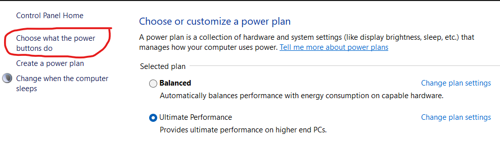
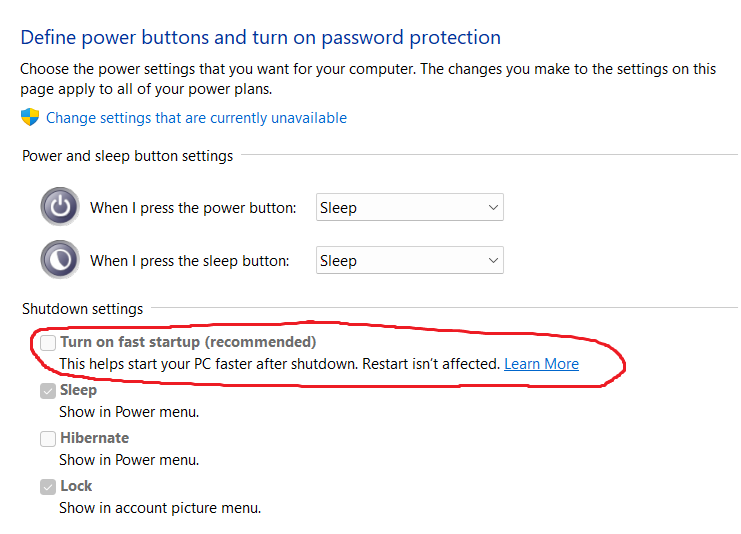
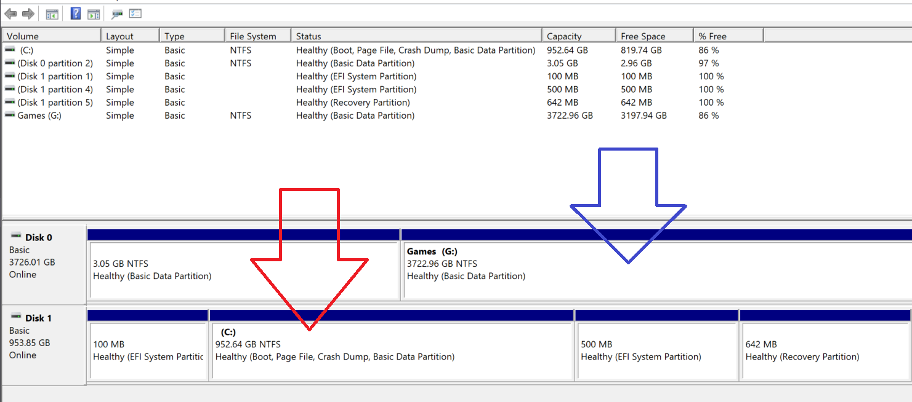
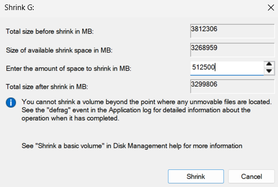
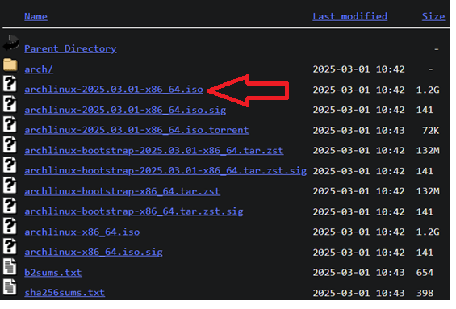
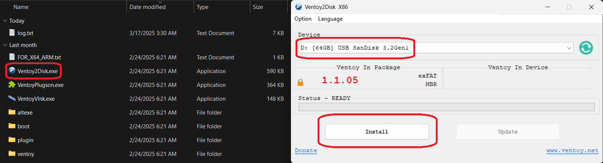
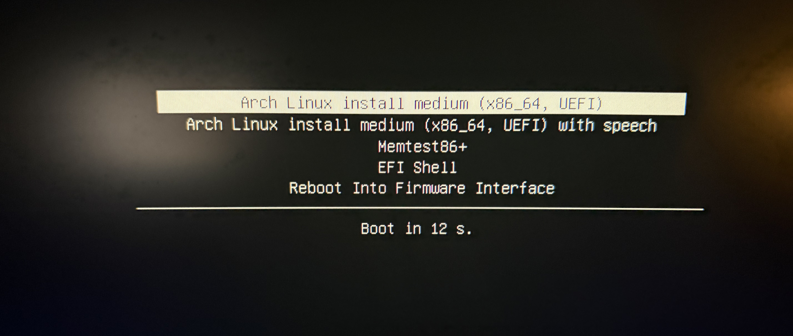
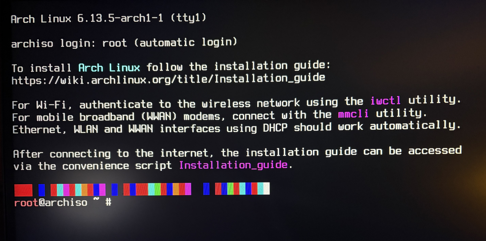

# Pre-Installation Guide
The pre-installation includes the setup prior to the dual boot and later intallation of arch linux along side your existing x64-bit Windows 10/11 OS.

---

## Prerequisites

✳️ Ensure your hardware is **compatible** with Arch Linux. See the [Arch Wiki Hardware Compatibility](https://wiki.archlinux.org/title/Category%3AHardware). Arch Linux runs on any x86_64 compatible machine with ~1GiB of RAM, so most modern systems are supported.

✳️ Ensure you have a **USB drive** with at least ~2GiB of space. If you don't have one, Sandisk is a good option for a reasonable price.

---

## How to Access UEFI/BIOS Settings and Boot Menu

| Manufacturer     | UEFI/BIOS Setup Key | Boot Menu Key |
|------------------|---------------------|---------------|
| **Acer**         | F2                  | F12           |
| **ASRock**       | F2 or Del           | F11           |
| **Asus**         | Del or F2           | Esc or F8     |
| **Asus Laptop**  | F2                  | Esc           |
| **Dell**         | F2                  | F12           |
| **Gigabyte**     | Del                 | F12           |
| **HP**           | F10                 | Esc or F9     |
| **Lenovo**       | F1 or F2            | F12           |
| **ThinkPad**     | Enter then F1       | F12           |
| **MSI**          | Del                 | F11           |
| **Samsung**      | F2                  | Esc or F12    |
| **Toshiba**      | F2                  | F12           |
| **Zotac**        | Del                 | F11           |

---

## What We Will Get Done

- Disable **Fast Startup** in Windows and disable **Secure boot** in UEFI settings.

- Create **Free space** on our disk for Arch Linux.

- Download the latest **Arch Linux ISO** for our medium installation live environment. 

- Download **Ventoy**, a USB bootable media creation tool that supports multi-ISO booting.
  
- **Boot** into the Arch Linux ISO live environment.  

---

## Disabling Windows Fast Startup

1. Press `Win + R`, then type `powercfg.cpl` to enter Windows Power Options.

2. Go to `choose what the power buttons do` > `Change settings that are currently unavailable`. 

1. Disable the `Turn on fast startup` option. 

---

## Disabling Secure Boot

1. This next step will be made in the system `UEFI/BIOS` so read this entire section before proceeding, because you will be logged out. 

2. Every UEFI menu will be different, but it will look something like this:  Search for anything that says `Security` and move to that tab via the `Arrow Keys`, `Tab`, and `Esc` or just with your Mouse.

3. Once Your in the `Security` section, look for `Secure Boot` and disable it. It might be in its own section, but you should be able to find it. 

4. Save the changes and exit the `UEFI/BIOS` and you will boot back into Windows. 

---

## Free Up Space

1. Press `Win + R`, then type `diskmgmt.msc` to enter Windows Disk Manager.

2. Pick the `Partition` you would like to free up space in, typically a drive that you have plenty of space in. This could be the `C:\` or `G:\` Drive in this example: 

3. Right click your chosen `Partition` and click `Shrink Volume`. Now, free up however much space you think you will use in your arch linux installation.

   For this example, I will choose 500GiB + 500MiB. The reason for the extra 500MiB is because we will need a special *EFI* partition for Arch Linux. To calculate the MiB number equivalent to 500GiB + our EFI partition, calculate `1024MiB * 500GiB + 500MiB` = `512,500MiB`. 

---

## Download Arch Linux

1. Plug in the USB Stick to your computer. 

2. Create a new folder in your USB Drive called `ISO`. 

3. Go to the official Arch Linux Website [Download Page](https://archlinux.org/download/). Scroll down and go to the country closest to you and click a reputable domain such as .edu. For example `arizona.edu` would be good for the United States. You'll see something like this: 
   
4. Download the ISO to your USB in the `ISO` folder.

---

## Download Ventoy

**IF YOU HAVE ANY IMPORTANT DATA ON THIS USB DRIVE BACK IT UP, IT WILL BE WIPED!!!**

1. Go to the official Ventoy [Download Page](https://ventoy.net/en/download.html) and click on the windows.zip file. 

2. Extract the downloaded zip file and run the `Ventoy2Disk.exe` executable.

3. You'll see something like this: 

4. Under the `Device` dropdown menu, select your USB Drive, and then press `Install`.

---

## Boot Into Arch Linux

1. Reboot your computer and enter the `Boot Menu`. 

2. Select your USB Drive to boot into `Ventoy`: 
   
3. Select `Boot in normal mode`.

4. Choose `Arch Linux install medium (x86_64, UEFI)`: 

## Finally Done 🎉

**Congratulations!!! You have finally booted into Arch Linux!!** 🎆 

We are now ready to move on to the [Installation](installation.md) of Arch Linux alongside Windows. 
