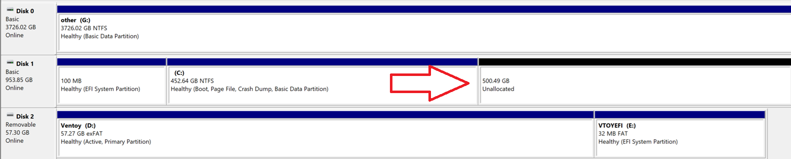

# Pre-Installation Guide
The pre-installation includes the setup prior to the dual boot and later intallation of arch linux along side your existing x64-bit Windows 10/11 OS. Note that no prior knowledge is required for completing this guide, I assume you know very little/nothing about the subject. I'll walk you through step by step.  

---

## Prerequisites

✳️ Ensure your hardware is **compatible** with Arch Linux. See the [Arch Wiki Hardware Compatibility](https://wiki.archlinux.org/title/Category%3AHardware). Note that Arch Linux is known for being well supported and requires minimal system resources to boot and run. Typically most x86-x64 architecture systems with ~1GiB+ of RAM will work. **In 2025 NVIDIA GPUs don't have the *greatest* support for Linux but are still ALOT better than they used to be.**

✳️ Ensure you have a **USB drive** with at least ~4GiB of space. If you don't have one, [Sandisk](https://www.amazon.com/SanDisk-Ultra-Flash-Drive-SDCZ48-016G-GAM46/dp/B081QSX1M5/ref=pd_bxgy_d_sccl_1/142-7974215-1770315) is an  excellent option at a reasonable price and good performance.

---

## How to Access UEFI/BIOS Settings and Boot Menu

| Manufacturer     | UEFI/BIOS Setup Key | Boot Menu Key |
|------------------|---------------------|---------------|
| **Acer**         | F2                  | F12           |
| **ASRock**       | F2 or Del           | F11           |
| **Asus**         | Del or F2           | Esc or F8     |
| **Asus Laptop**  | F2                  | Esc           |
| **Dell**         | F2                  | F12           |
| **Gigabyte**     | Del                 | F12           |
| **HP**           | F10                 | Esc or F9     |
| **Lenovo**       | F1 or F2            | F12           |
| **ThinkPad**     | Enter then F1       | F12           |
| **MSI**          | Del                 | F11           |
| **Samsung**      | F2                  | Esc or F12    |
| **Toshiba**      | F2                  | F12           |
| **Zotac**        | Del                 | F11           |

---

## What We Will Get Done

*All of these steps will be split into sections like the below (in order) and explained*

- Disable **Fast Startup** in Windows and disable **Secure boot** in UEFI settings.

- Create **Free space** on our disk for Arch Linux.

- Download the latest **Arch Linux ISO** for our medium installation live environment. 

- Download **Ventoy**, a USB bootable media creation tool that supports multi-ISO booting.
  
- **Boot** into the Arch Linux ISO live environment.  

---

## Disabling Windows Fast Startup

*Fast Startup* doesn't fully shut down your system when ordered to, it instead keeps your computer in a hybrid sleep state. This can lock the Windows drive, causing problems when Arch Linux tries to access any shared partitions/drives. Disabling it ensures that Linux and Windows can coexist safely without data corruption.

1. Press `Win + R`, then type `powercfg.cpl` to enter Windows Power Options.

2. Go to *Choose what the power buttons do* -> *Change settings that are currently unavailable* 

3. Disable the *Turn on fast startup* option. 

---

## Disabling Secure Boot

*Secure Boot* only allows **signed/authorized** bootloaders to run. Windows is signed, but Arch Linux the GRUB or systemd bootloaders which are **unsigned/unauthorized**. If secure boot is enabled in your BIOS/UEFI settings, arch linux will not boot or run into errors during installation. Disable this for freedom to boot to Linux.

**Before proceeding, take a picture of this section because you will be logged out!**. 

1. To boot into the *UEFI/BIOS Settings*, restart your computer. While its rebooting, relentlessly spam one of the [UEFI/BIOS Setup Keys](#how-to-access-uefibios-settings-and-boot-menu) your manufacturer uses. Make sure you use the **UEFI/BIOS** keys in the chart, not the *Boot Menu* keys.

2. Every UEFI menu will be different, but it will look something like this:  Search for anything that says `Security` and move to that tab via the `Arrow Keys`, `Tab`, and `Esc` or just with your Mouse.

3. Once Your in the `Security` section, look for `Secure Boot` and disable it. It might be in its own section, but you should be able to find it. 

4. Save the changes and exit the `UEFI/BIOS` and you will boot back into Windows. 

---

## Free Up Space

Windows is currently using 100% of your drive, so we need to make room for our Linux installation. **WE ARE NOT** deleting any data on your computer! We're simply carving out the available *unallocated/free space* for Arch Linux. We shrink 500MiB for an *EFI System Partition* to ensure enough space for both Windows and Arch boot files, plus a bit of cushion.

1. Press `Win + R`, then type `diskmgmt.msc` to enter Windows Disk Manager.

2. Pick the `Partition` you would like to free up space in, typically a drive that you have plenty of space in. This could be the `C:\` or `G:\` Drive in this example: 
   
    Note that you may see *Recovery Partitions* or other small system partitions - **avoid** rezising or deleting those. You only need to shrink the main Windows partition of choice. 

3. Right click your chosen Partition and choose `Shrink Volume`. Now, free up however much space you think you will use in your arch linux installation. In this case, I will shrink **500GiB + 500MiB** of space - *This should be enough if you're new to linux.* The extra 500MiB is for the *EFI System Partition* as mentioned before. To calculate the MiB number equivalent to 500GiB + our 500MiB EFI partition, calculate *1024* * *500* + *500* = *512,500*.
   
   Convert back to gigabytes to check our work: ***512,500 MiB / 1024 ≈ 500.49 GiB***. Perfect! ✔️

   

   

   After the partition is shrunk, **LEAVE IT AS IS**, Arch Linux needs the space unformatted. 
---

## Download Arch Linux

The *ISO file* we will download for this is like a digital version of the Arch Linux installation DVD. it contains a nice environment which has **everything** needed to boot boot into and install the OS. 

1. Plug in the USB Stick to your computer. 

2. You'll see a popup in Windows telling you a new drive was detected. Go to *File Explorer* -> *USB Drive*. Create a new folder in your USB Drive called `ISO`. 

3. Go to the official Arch Linux Website [Download Page](https://archlinux.org/download/). Scroll down until you see your country or a country closest to you. Click a reputable domain such as **.edu**. For example, if you're in the US, *arizona.edu* would be good option. You'll see something like this: 
   
4. Download the top file to the `ISO` directory. It'll look something like: *archlinux-version-x86_64.iso* just like in the image.

---

## Download Ventoy

Ventoy is a cross-platform tool that turns your USB drive into a **bootable** drive — but instead of flashing just one ISO, it lets you drop in **multiple** ISOs and boot any of them without reformatting again. You could store as many Linux Distros or Windows versions that your USB Drive has room for.

**IF YOU HAVE ANY IMPORTANT DATA ON THIS USB DRIVE BACK IT UP, IT WILL BE WIPED!!!**

1. Go to the official Ventoy [Download Page](https://ventoy.net/en/download.html) and click on the windows.zip file. 

2. Extract the downloaded zip file and run the `Ventoy2Disk.exe` executable.

3. You'll see something like this: 

4. Under the *Device* dropdown menu, select your USB Drive, and then press *Install*.

---

## Boot Into Arch Linux

Now that you’ve downloaded the ISO and set up Ventoy, it’s time to **boot** your computer from the USB and enter the *Arch Installation Environment*. This is where the real installation happens — a command-line interface (TTY) will load up that lets you install Arch onto your drive.

1. Reboot your computer and enter the *Boot Menu*. If you don't know how to do this, relentlessly spam one of the [Boot Menu Keys](#how-to-access-uefibios-settings-and-boot-menu) your manufacturer uses. Make sure you use the **Boot Menu** keys in the chart, not the *UEFI/BIOS* keys.

2. Once in Select your USB Drive. This will take you to the **Ventoy EFI Tool** which allows us to pick the ISO we want to boot into. Next choose **Boot in normal mode**. You will now see the *archlinux-version-x86_64.iso* option to boot into the Arch Linux installation environment.        . 

3. Choose `Arch Linux install medium (x86_64, UEFI)`: 

## Finally Done 🎉

**Congratulations!!! You have finally booted into Arch Linux!!** 🎆 

We are now ready to move on to the [Installation](installation.md) of Arch Linux alongside Windows. 
